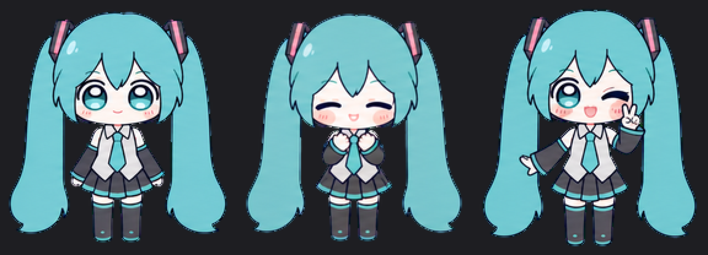
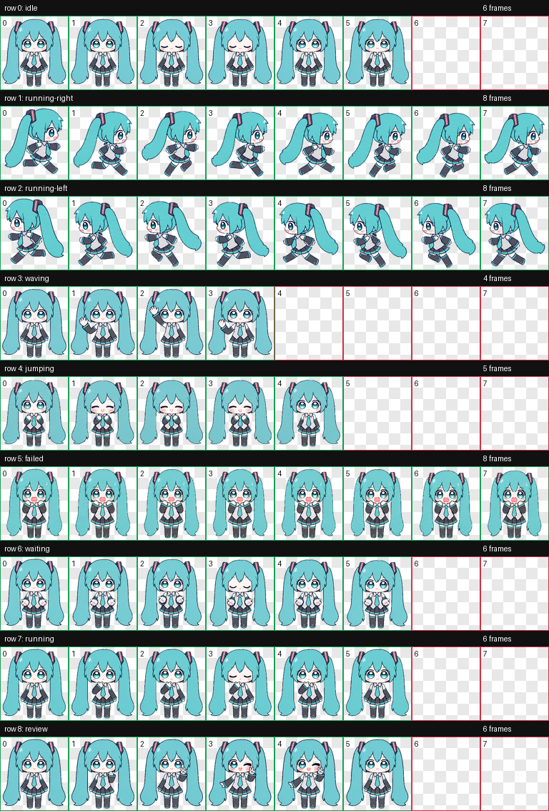

<p align="center">
  
</p>

# Miku Codex Pet

一只青绿色双马尾、会认真思考也会慌张掉眼泪的 Q 版 Miku Codex 桌宠。

Miku 是一套可以直接安装的 Codex 原生 v1 桌宠资源包。它包含九种标准状态：待机、左右移动、挥手、摸头反应、失败、等待输入、思考工作和完成比耶。图集保持透明背景、统一比例与稳定基线，并刻意移除了冗余的 16 向视线。

[动作图鉴](#动作图鉴) · [快速安装](#快速安装) · [动作语义与触发](#动作语义与触发) · [项目结构](#项目结构) · [版权与声明](#版权与声明)

## 动态动作预览

<table>
  <tr>
    <td align="center"><br><code>idle</code><br>待机</td>
    <td align="center"><br><code>jumping</code><br>摸头反应</td>
    <td align="center"><br><code>running</code><br>认真思考</td>
  </tr>
  <tr>
    <td align="center"><br><code>failed</code><br>慌张失败</td>
    <td align="center"><br><code>review</code><br>完成比耶</td>
    <td align="center"><br><code>waving</code><br>挥手</td>
  </tr>
</table>

## 动作图鉴

| 状态 | 语义 | 单帧预览 |
| --- | --- | --- |
| `idle` | 呼吸与眨眼 |  |
| `running-right` | 向右移动 |  |
| `running-left` | 向左移动 |  |
| `waving` | 挥手互动 |  |
| `jumping` | 被摸头后的闭眼、脸红与开心反应 |  |
| `failed` | 双手贴脸、流泪和冒汗的慌张表情 |  |
| `waiting` | 等待用户输入或确认 |  |
| `running` | 站立摸下巴的思考状态 |  |
| `review` | 任务完成后的眨眼比耶 |  |

### 完整动作图集



每格为 `192 × 208`；图集是 8 列 × 9 行、`1536 × 1872` 的透明无损 WebP。已使用的帧完整，未使用格完全透明。

## 快速安装

### Agent 安装

如果你的 Agent 具备网络访问和本地文件读写权限，可以复制下面的提示词：

```text
请帮我安装 GitHub 仓库 https://github.com/lukino0737/miku-codex-pet 中的 Codex 原生桌宠 Miku。

请执行以下步骤：
1. 克隆仓库并找到 output/miku/pet.json 与 output/miku/spritesheet.webp。
2. 安装目录为 macOS/Linux 的 ~/.codex/pets/miku/，或 Windows 的 %USERPROFILE%\.codex\pets\miku\。
3. 如果已经安装过 Miku，先把旧目录移动到 ~/.codex/pet-backups/ 或 %USERPROFILE%\.codex\pet-backups\；不要把备份留在 pets 目录内，否则会出现两个 Miku。
4. 只复制 pet.json 和 spritesheet.webp，不要修改其他宠物。
5. 确认 pet.json 的 id 为 miku，图集尺寸为 1536 × 1872。
6. 安装后提醒我重新打开或刷新 Codex 的 Pets 列表并重新选择 Miku。
7. 不要点击 Miku 旁边的“更新”，因为这个 v1 包刻意不包含 16 向视线。
```

### macOS / Linux

```bash
git clone https://github.com/lukino0737/miku-codex-pet.git
cd miku-codex-pet

PET_DIR="$HOME/.codex/pets/miku"
BACKUP_ROOT="$HOME/.codex/pet-backups"

mkdir -p "$BACKUP_ROOT"
if [ -d "$PET_DIR" ]; then
  mv "$PET_DIR" "$BACKUP_ROOT/miku-$(date +%Y%m%d-%H%M%S)"
fi

mkdir -p "$PET_DIR"
cp output/miku/pet.json output/miku/spritesheet.webp "$PET_DIR/"
```

检查安装结果：

```bash
ls -lh "$HOME/.codex/pets/miku/pet.json" "$HOME/.codex/pets/miku/spritesheet.webp"
```

### Windows（PowerShell）

```powershell
git clone https://github.com/lukino0737/miku-codex-pet.git
Set-Location .\miku-codex-pet

$homeDir = [Environment]::GetFolderPath("UserProfile")
$petDir = Join-Path $homeDir ".codex\pets\miku"
$backupRoot = Join-Path $homeDir ".codex\pet-backups"

New-Item -ItemType Directory -Force -Path $backupRoot | Out-Null
if (Test-Path $petDir) {
  $stamp = Get-Date -Format "yyyyMMdd-HHmmss"
  Move-Item $petDir (Join-Path $backupRoot "miku-$stamp")
}

New-Item -ItemType Directory -Force -Path $petDir | Out-Null
Copy-Item .\output\miku\pet.json, .\output\miku\spritesheet.webp -Destination $petDir
```

### 手动安装

最终目录必须是：

```text
~/.codex/pets/miku/
├── pet.json
└── spritesheet.webp
```

不要把整个仓库或备份目录放进 `~/.codex/pets/`。Codex 会扫描这个目录下的宠物包，留下带有 `pet.json` 的备份会产生重复的 Miku。

安装后重新打开 Codex，前往 **Settings → Pets** 刷新列表并选择 Miku。请勿点击 Miku 旁边的蓝色“更新”。

## 动作语义与触发

| 原生状态 | Miku 的表现 | 常见触发场景 |
| --- | --- | --- |
| `idle` | 待机、呼吸、眨眼 | 默认空闲 |
| `running-right` | 面向右侧奔跑 | 宠物向右移动或拖动 |
| `running-left` | 面向左侧奔跑 | 宠物向左移动或拖动 |
| `waving` | 抬手挥手 | 启动或互动反馈 |
| `jumping` | 闭眼、脸红、轻轻低头 | 鼠标悬停在宠物上，表现为摸头反应 |
| `failed` | 双手贴脸、眼泪、汗滴和慌张嘴 | 任务失败 |
| `waiting` | 期待地等待 | 需要用户输入、确认或批准 |
| `running` | 站立摸下巴思考 | 任务执行中 |
| `review` | 眨眼、笑脸和脸侧 V 手势 | 任务完成或审阅结束 |

`animation-triggers.json` 是便于阅读和二次开发的声明式映射，不会自行监听鼠标或任务事件。实际触发由 Codex 当前版本负责。

## 项目结构

```text
miku-codex-pet/
├── output/miku/               # 可直接安装的桌宠包
│   ├── pet.json
│   └── spritesheet.webp
├── gif/                       # 九种状态的动画预览
├── previews/                  # 九种状态的透明 PNG 单帧预览
├── assets/readme/             # README 宣传图与完整联系表
├── qa/validation.json         # 图集结构验证结果
├── animation-triggers.json    # 声明式动作映射
├── ANIMATION-TRIGGERS.md      # 动作语义说明
├── ASSET-USAGE.md             # 素材使用边界
├── NOTICE.md                  # 角色权利与项目声明
└── README.md
```

## 已知限制

- 本项目使用 Codex v1 九行动画接口，因此 `pet.json` 故意不包含 `spriteVersionNumber: 2`。
- 该版本没有 16 向视线。鼠标悬停用于触发摸头反应，而不是让眼睛跟随鼠标。
- Codex 的“更新”按钮可能用其他版本覆盖本地包；希望保留本项目效果时请不要点击。
- 不同 Codex Desktop 版本可能调整状态触发时机，但九个原生状态名保持在映射文件中。
- 本仓库只包含桌宠资源，不包含独立的鼠标监听器、任务监听器或常驻后台程序。

## 版权与声明

本项目是非官方、非商业的个人同人衍生项目，与 Crypton Future Media, INC.、初音未来官方及 OpenAI 不存在隶属、合作、赞助或背书关系。

本作品依据[ピアプロ・キャラクター・ライセンス（PCL）](https://piapro.jp/license/pcl/summary)，描绘了 Crypton Future Media, INC. 的角色“初音未来”。请同时遵守[角色使用指南](https://piapro.jp/license/character_guideline)。

Miku／初音未来及相关角色权利归 Crypton Future Media, INC. 及其他相关权利人所有。桌宠图集是基于用户提供的视觉参考、人工选择与 Codex 辅助生成整理的二次创作；仓库不包含用户提供的原始参考图片。

本项目仅供非商业学习、展示和个人使用。详情见 [NOTICE.md](NOTICE.md) 与 [ASSET-USAGE.md](ASSET-USAGE.md)。

